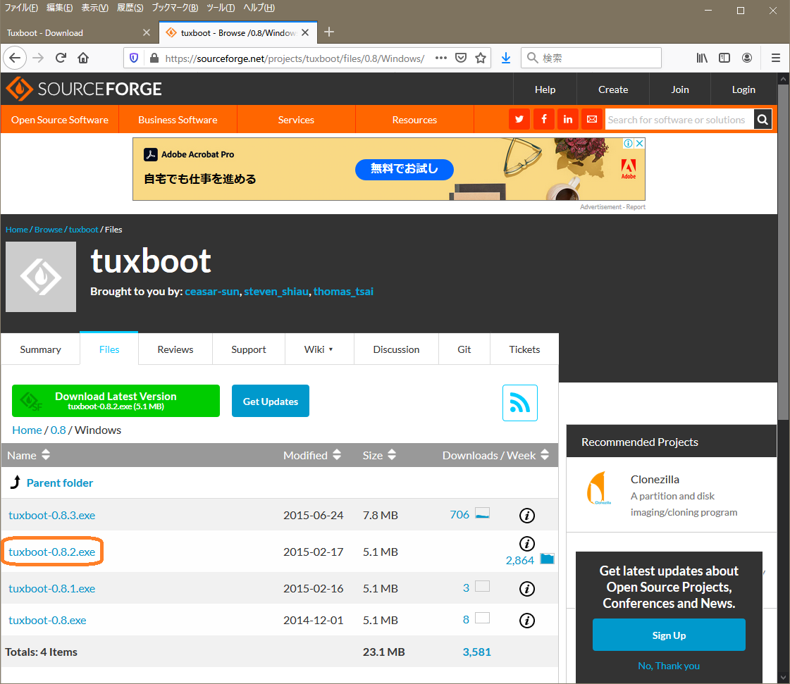

# Linux Developers Guide

ahidaka / LinuxDevelopersGuide / GParted-usb.md
 

## GParted USB

DISK丸ごとコピー以外のディスク操作が何でもできる便利ツール。最近まで Linux 上のアプリケーションとしての配布だったが、Windows kara
から書き込める、USB ブートのOS(Linux) とセットでダウンロードできる様になった。GParted はほとんどの場合、OS の外から裸のドライブを対象に使うので、とても便利だ。

[**Tuxboot download**](https://tuxboot.org/download/)
の[リンク先のSourceForge](https://sourceforge.net/projects/tuxboot/files/) から、**0.8** → **Windows** と進んで、
tuxboot-0.8.2.exe for Windows を入手してそのまま実行する。GParted を別途入手する必要は無い。

Windows でTuxboot起動後、画面上部左側のリストボックスで **gparted-live-stable** を選択後、USBドライブも選択・確認して OK をクリック。完了後は EXIT をクリックして終了。

### 参考サイト
ぬこのおなかの備忘録【フリーソフト】USBブートのGparted Liveを作ってみる
https://itneko.blogspot.com/2019/01/usbgparted-live.html

https://gparted.org/liveusb.php
