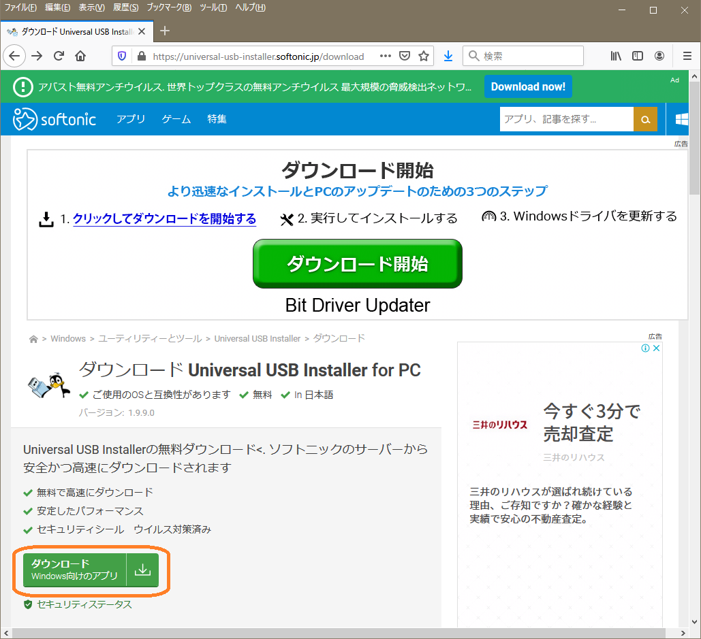

# Linux Developers Guide

ahidaka / LinuxDevelopersGuide / Ubuntu-iso-usb.md
 

## Ubuntu ISO イメージをブータブルな USB フラッシュメモリーに書き込む。

Universal USB Installer をダウンロードしてWindows上で起動後、
プルダウンメニューで該当のUbuntu(Linux) と ISO ファイルを選択して、Create をクリック。

Ubuntu Server と Ubuntu デスクトップとでは、プルダウンメニューの選択が異なるので注意が必要。

https://www.ubuntulinux.jp/download

https://universal-usb-installer.softonic.jp/

上記、softonic のサイトのダウンロードは広告が多いので注意。下記のボタンを1回クリック後、再度表示される。

### 参考サイト

- Linux UbuntuのブータブルUSBドライブを作成する手順 
	https://itlogs.net/ubuntu-bootable-usb/  

- Rufusを使用する場合
	Windows 10でUbuntuのインストール用USBメモリを作成 
	https://www.archlinux.site/2018/03/windows-10ubuntuusb.html  
	[Rufus ダウンロード https://rufus.ie/](https://rufus.ie/)  

