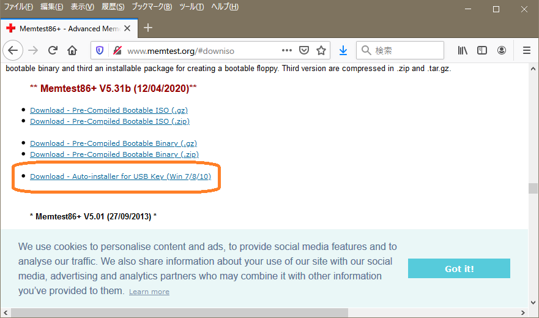

# Linux Developers Guide

ahidaka / LinuxDevelopersGuide / memtest86.md
 

## memtest86+

DOS / Windows 版のツールだが Linuxにも関係あるので掲載。

Memtest86+ はその昔の Memtest86 の頃から、かなり厳格にPCのメモリーモジュールのエラーチェックを行うツールとして有名で、「Memtest86を一晩実行すればメモリーエラーが分かる」等、PC自作や業務用PCのメンテナンスには欠かせないツールだった。

その発祥にも由来する問題は、DOSが起動するフロッピーディスク1枚に入れて使用する必要がある点で、このためだけにDOS起動可能なFD数枚と、USB-FDD 2セットを30年以上管理・維持し続けて来た。今では Ubuntu等のLinuxブートCDにも含まれる様になったが、肝心かなめなツールであるにも関わらず、著名度が低く、一般にはあまり受け入れられているとは言えない状況だった。

それがやっとUSBブートに対応したので、是非とも使って欲しい。使い方は簡単で、zip ファイル展開後、起動してUSBドライブを選択するだけだ。

### ダウンロードサイト

[Memtest86](http://www.memtest.org/)

http://www.memtest.org/

**Download (Pre-built & ISOs)** をクリックする。

 

**Download - Auto-installer for USB Key (Win 7/8/10)** が目的の zip ファイル。

 

